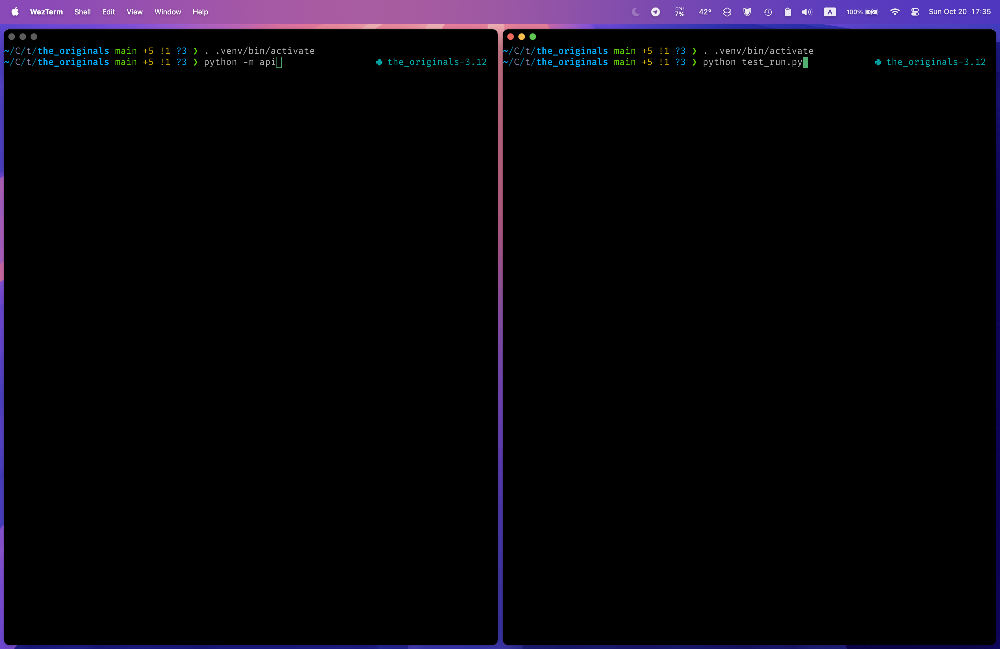
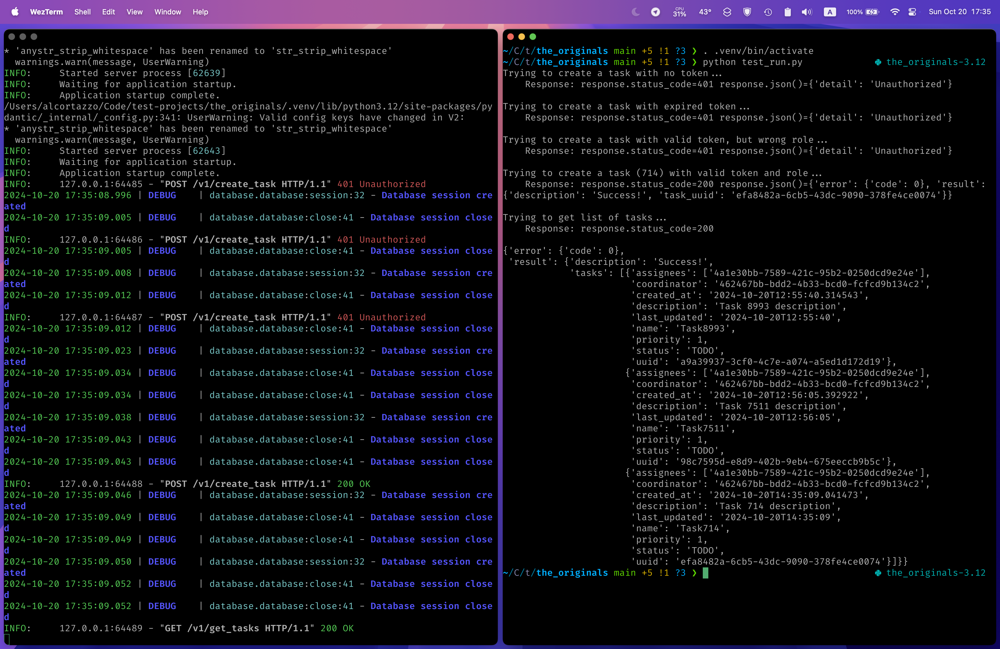
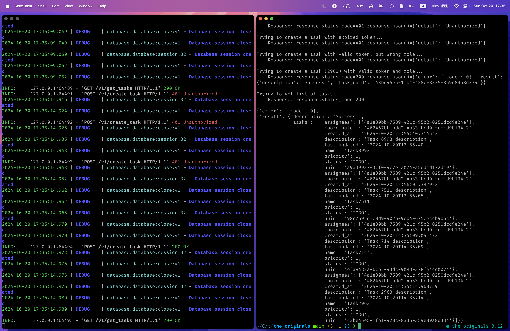

Щоб запустити програму, нам потрібно налаштувати віртуальне оточення і встановити всі необхідні бібліотеки. Для цього використовуємо наступні команди:
```bash
python -m venv .venv
````
```bash
. .venv/bin/activate
# або
source .venv/bin/activate
```
```bash
pip install -r requirements.txt
```

Після цього запускаємо API сервер за допомогою команди:
```bash
python -m api
```
Та запускаємо тестовий скрипт, який зимітує запити від фронтенду:
```bash
python test_run.py
```

Приклади



